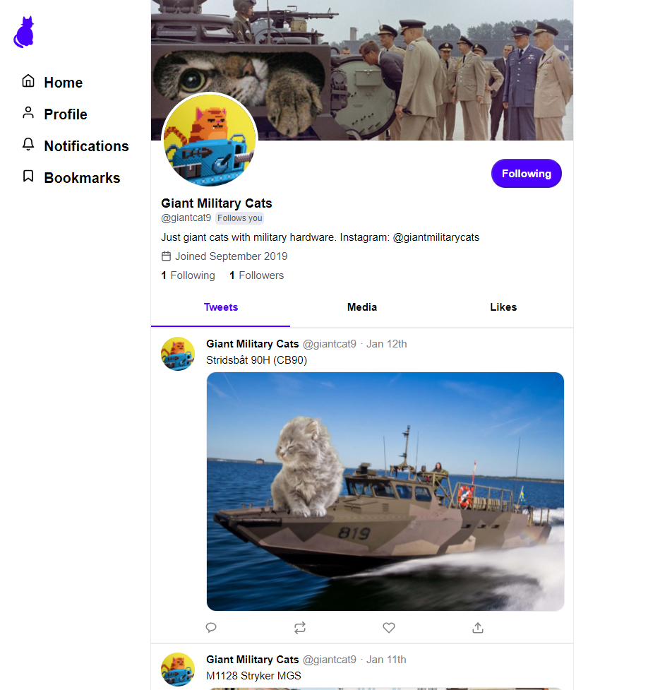

# Twitter clone

# Introduction

This React application was developed while enrolled in a Full-stack web development bootcamp (Concordia University), given a backbone application (server was created for us). This application focuses on the front-end and API requests.

# Demo

Demo link:

# Project features

- `/tweet/:tweetId` shows the details for the specified tweet.
- root URL `/` shows a list of tweets from the accounts that the current user follows.
- `/:profileId` displays information about the user, above a list of that user's tweets (and retweets)
- Clicking the like button increments or decrements the number of likes.
- On the homepage, the user can create a tweet.
